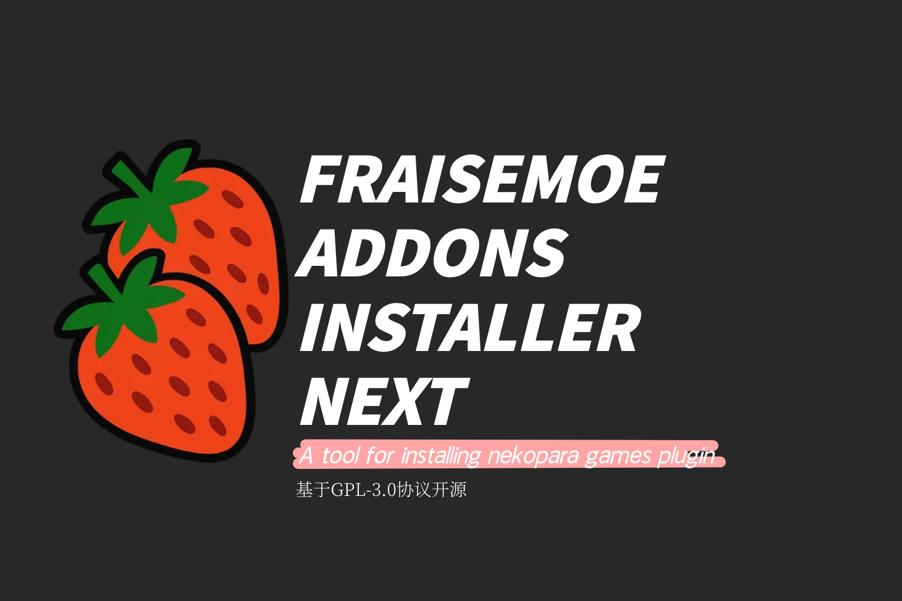

  
  <h2 style="margin: 10px 0 5px 0; font-weight: bold; color: #e75480;">🍓 FRAISEMOE NEKOPARA Addons Installer NEXT🍓</h2>
  
An application for installing patches for the Nekopara series games.

  

    <a href="./FAQ.md">简体中文</a> | 
    <a href="./FAQ-en.md">English</a>
  

  <blockquote style="color: #c00; font-weight: bold; border-left: 4px solid #e75480; background: #fff0f5; padding: 10px;">
    The English version is not updated in real-time! Please check the Simplified Chinese version for more updates! Thank you for your support!
  </blockquote>
  <blockquote style="color: #c00; font-weight: bold; border-left: 4px solid #e75480; background: #fff0f5; padding: 10px;">
    Please strictly follow all the rules in the <a href="https://github.com/hyb-oyqq/FRAISEMOE-Addons-Installer-NEXT/blob/master/FAQ.md">User Guide</a>. The developers are not responsible for any violations. 
    This tool is for educational and communication purposes only. Do not use it for commercial purposes.
  </blockquote>

---

## 🎮 Applicable Games:

- **NEKOPARA Vol. 1**
- **NEKOPARA Vol. 2**
- **NEKOPARA Vol. 3**
- **NEKOPARA Vol. 4**
- **NEKOPARA After**

---

⛔ **Special Reminder:**

> **1. Patches cannot be installed for NEKOPARA Vol. 0 & NEKOPARA Extra ❗**

> **2. Patches will not be installed for games you do not own ❗**

> **3. This tool is only for installing patches, not for installing games ❗ It only runs on Windows 10/11 64-bit systems (other platforms or versions have not been tested) ❗**

> **4. The tool requires administrator privileges to run ❗
> Reason: To prevent installation issues caused by the game running, the tool will get game process information to close the game before starting ❗**

> **5. Before using this tool, you need to understand the basics of patch installation:**
>
> **5-1. Why install the patch? What's in the patch?**
>
> **5-2. Based on the documentation, why do errors occur? Or why does the installation fail?**
>
> **5-3. After a successful installation, how to check the patch settings to confirm it was installed correctly?**
>
> ***If you are completely unfamiliar with the above, please do not use this tool or watch the tutorial video. If you have already downloaded the tool, it is recommended to move it to the Recycle Bin and delete it.***

> **6. Make sure you are using the latest version of the application (please regularly check for updates on the mirror site or GitHub and download them) ❗**

---

## **🔄 Usage/Flow:**

1. Download "FRAISEMOE Addons Installer NEXT.exe" from the repository.
2. **Close any running games from the ["Applicable Games"](#-applicable-games) list.**
3. If the application asks for administrator privileges, grant them. **If administrator privileges cannot be obtained, the application will not run and will exit automatically.**
4. If the application asks to close a running game, select "Yes". **If the running game cannot be closed, the application will not run and will exit automatically.**
5. After launching the application, select "Start Install" and choose the **parent directory of the game directory.** 

   > **Important Note 1** ❓ What is the "parent directory of the game directory"? How to get it?
   > Taking Steam as an example, find the "Library" tab at the top, then find a [patchable game](#-applicable-games) in the game list on the left; Right-click the game in the list, select "Manage" -> "Browse local files" to get the game directory. Then, click the "←" button in the address bar. If you see the [game's folder, e.g., "NEKOPARA Vol. 1"](#-applicable-games) in the file explorer, then this is the parent directory of the game directory. Select and copy the full path from the address bar.

   > **Important Note 2** ❓ How to use this tool for games from third-party installers?
   > Since the installation path for third-party games is not fixed, please copy the parent directory path of the game directory yourself, similar to the method for Steam.

   > Example (for illustration only, do not copy directly):
   > Game folder: C: (drive letter may vary)\Steam\steamapps\common\NEKOPARA Vol. 1
   > Parent directory of game directory: C: (drive letter may vary)\Steam\steamapps\common

6. In the folder selection dialog, **paste the copied path into the address bar** and click "Select Folder". **(Note whether the text next to the "Select Folder" button is the last folder name in the path. If not, you may need to re-select).**

   > √ Correct Example (for illustration only, do not copy directly):
   > Path entered in the address bar above: C: (drive letter may vary)\Steam\steamapps\common
   > Folder name below: common

7. After selecting the folder, you may encounter the following situations:
<table>
    <tr>
        <td><h5>Status</h5></td>
        <td><h5>Action</h5></td>
    </tr>
    <tr>
        <td>Game exists, but patch is not installed</td>
        <td>Proceeds directly to download task</td>
    </tr>
    <tr>
        <td>Game exists, but patch is installed from another source or patch file is corrupted</td>
        <td>Asks whether to reinstall the patch from this tool. If the patch from another source is usable, you can choose not to reinstall</td>
    </tr>
    <tr>
        <td>Game does not exist</td>
        <td>Skips the patch installation step</td>
    </tr>
    <tr>
        <td>Game exists, but the corresponding patch version cannot be installed with this tool</td>
        <td>Repeat the previous installation steps</td>
    </tr>
</table>

8. Confirm the final installation result, then select "Exit".
9. Enter the game and check if there are more options in "Settings". Or if you have previously entered the extra story and it appears in the "EXTRA" option, it means the patch was installed successfully. If none of the above is observed, repeat the installation steps.

---

## 🔰 Software Features:

- Detects installed patch files for ["Applicable Games"](#-applicable-games) and compares their [Hash (SHA-256)](#-hashsha-256-checksums) to verify integrity. If normal, it skips installation for that version; If patches from other sources are used or patch files are corrupted, it asks whether to reinstall. If you choose to reinstall, it will automatically delete old patch files, download the patch package, and reinstall it.
- Detects all unpatched versions and performs installation tasks.

---

## ❓ FAQ & User Guide

---

<h4><u>【Important】Why did the download fail?</u></h4>

1. Please check if the "final folder" in the address bar of the "Folder Selector" matches the "Folder Name" below (above the "Select Folder" button). If they do not match, it will not work correctly. If this is not the issue, proceed to the next step.
2. Please check if the selected folder contains the [game folder](#-usageflow) (refer to step 5 in the usage flow). If the game folder does not exist, it will not work correctly. If this is not the issue, proceed to the next step.
3. Please check if your network environment is normal and the connection is stable. If this is not the issue, proceed to the next step.
4. If the installation result is displayed directly (i.e., the installation step was skipped), it means the path is incorrect and the game could not be identified. Please check the path and try again. <b>If you are using a non-Steam version, please find the relevant resources to install it yourself.</b>
5. Please go to [GitHub](https://github.com/hyb-oyqq/FRAISEMOE-Addons-Installer-NEXT) or the [domestic mirror site blog](https://blog.ovofish.com/posts/c54d3755.html) to <b>check if you are using the latest version. The application will not work correctly if it is not the latest version.</b>

---

<h4><u>【Important】Encountered an error and need to report it? How to submit a bug report?</u></h4>

1. First, please rule out if it is a local network problem.
2. Second, please enable debug mode, run the program again, and <b>save a screenshot of the error along with the log.txt file from the same directory.</b>
3. Finally, <b>please [submit an Issue on GitHub](https://github.com/hyb-oyqq/FRAISEMOE-Addons-Installer-NEXT/issues).</b>

---

<h4><u>During Use</u></h4>

- The application is open but loading slowly.
  - Please wait patiently for a while; the program is not unresponsive.
- Do not open the application multiple times during loading to avoid unnecessary issues.

<h4><u>"Application is already running" / "In use" prompt when opening</u></h4>

- This is caused by opening the application too frequently, causing Task Manager to fail to refresh. Please manually open Task Manager, find "FRAISEMOE Addons Installer NEXT", end its process, and then restart.

<h4><u>1. Download Errors</u></h4>

<table>
    <tr>
        <td><h5>Common Error Types</h5></td>
        <td><h5>Error Information</h5></td>
    </tr>
    <tr>
        <td>Contains "403" / "Access denied by server"</td>
        <td>Access denied by the server. Check if you are using a network proxy (VPN), reset the network proxy (or exit the VPN program), then "Restart the application" and try again.</td>
    </tr>
    <tr>
        <td>Contains "port=443" / "An existing connection was forcibly closed by the remote host"</td>
        <td>Download interrupted. After other tasks have verified file integrity / download tasks are complete, use "Start Install" again and select the previously entered "parent directory of the game" to install.</td>
    </tr>
    <tr>
        <td>Contains other messages</td>
        <td>1. Mostly user network status is abnormal. Check and fix your network status before trying again. 2. In some cases, it may be a server failure. Please report the problem via GitHub Issues.</td>
    </tr>
</table>

<h4><u>2. Problems During Download and Installation</u></h4>
<table>
    <tr>
        <td><h5>Common Problem Types</h5></td>
        <td><h5>Solution</h5></td>
    </tr>
    <tr>
        <td>Download progress is slow or seems to have stalled</td>
        <td>If the progress has stalled but no error is reported, wait a moment.</td>
    </tr>
    <tr>
        <td>Window flickers when verifying file integrity</td>
        <td>This is normal, no action is needed.</td>
    </tr>
    <tr>
        <td>The download progress window pops up and is covered by the hash check window / the window close button turns red</td>
        <td>Some patch files are large, and calculating the hash value takes longer. Please wait a moment. If the wait is too long, you can manually click the main window/download progress pop-up/hash check window to refresh the status.</td>
    </tr>
</table>

<h4><u>3. Cannot exit the program during download</u></h4>

- To ensure the effectiveness of the patch, do not exit the program during download and installation. The user is responsible for any negative consequences of violating this notice.

<h4><u>4. Forcibly terminating the program during download</u></h4>

- This may cause patch file corruption. Restarting the application will automatically overwrite downloaded files. The user is responsible for any negative consequences of violating this notice.

<h4><u>5. Network speed significantly decreases after multiple downloads and installations, despite a normal network status</u></h4>

- To ensure server stability and resource security, download sources are divided into domestic and international. To guarantee download quality for more users, domestic sources have a download limit. Tasks exceeding the limit are forwarded to international sources for download.

<h4><u>6. Found an identical/similar repository/application outside of this repository</u></h4>

- It may be modified by other developers or use patch files from unknown sources. Do not download/use such repositories/applications.

<h4><u>7. User obtained this application through non-free means before using it</u></h4>

- This application is free and open-source. If you obtained it through a paid channel, please request a refund immediately and take action to protect your rights.

---

## 💫 HASH(SHA-256) Checksums

<table>
    <tr>
        <td><h5>Game Patch</h5></td>
        <td><h5>SHA-256 (Hash creation date: 2024/07-2024-08)</h5></td>
    </tr>
    <tr>
        <td>Vol.1</td>
        <td>04b48b231a7f34431431e5027fcc7b27affaa951b8169c541709156acf754f3e</td>
    </tr>
    <tr>
        <td>Vol.2</td>
        <td>b9c00a2b113a1e768bf78400e4f9075ceb7b35349cdeca09be62eb014f0d4b42</td>
    </tr>
    <tr>
        <td>Vol.3</td>
        <td>2ce7b223c84592e1ebc3b72079dee1e5e8d064ade15723328a64dee58833b9d5</td>
    </tr>
    <tr>
        <td>Vol.4</td>
        <td>4a4a9ae5a75a18aacbe3ab0774d7f93f99c046afe3a777ee0363e8932b90f36a</td>
    </tr>
</table>
